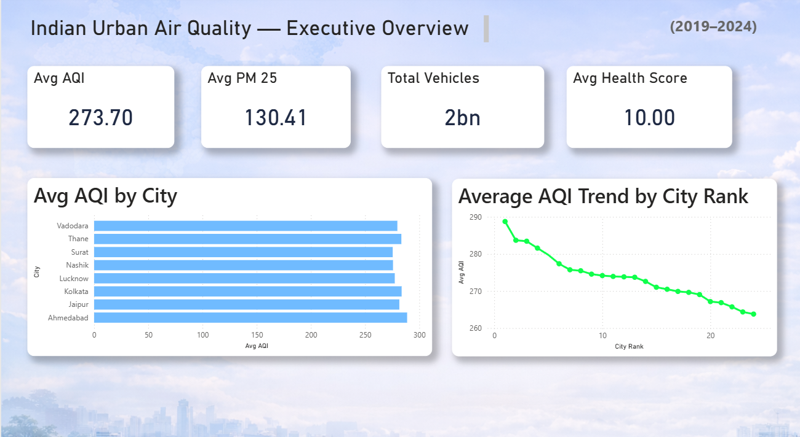
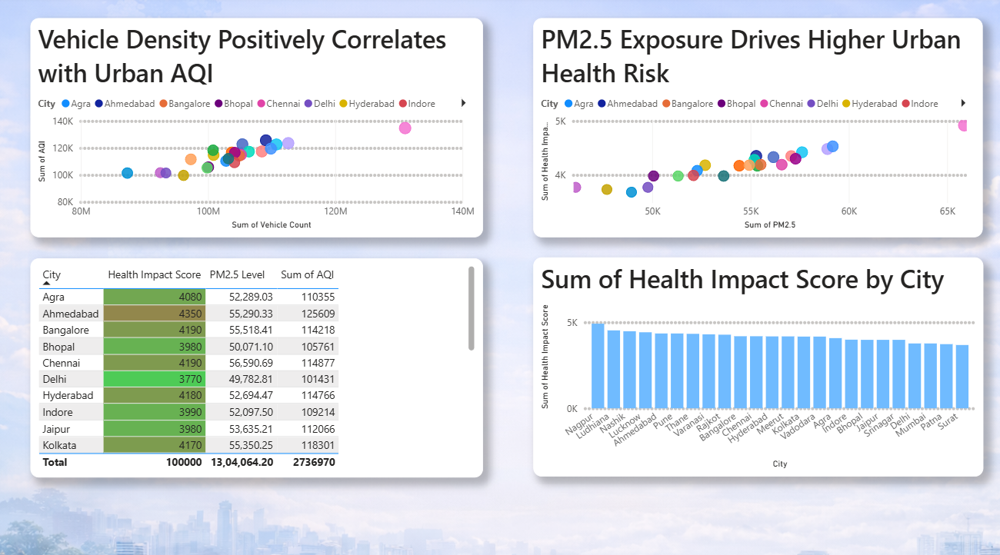
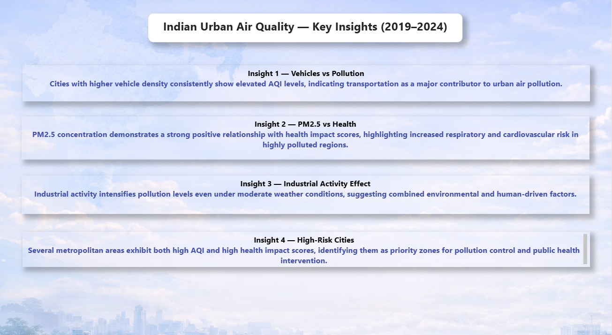

# Indian Urban Air Quality & Health Impact Analysis (2019–2024)

## Project Overview
This Power BI dashboard analyzes air pollution trends across major Indian urban cities, focusing on AQI, PM2.5 concentration, vehicle density, industrial impact, and health risk indicators.

## Business Objective
To identify major pollution contributors and evaluate their public health implications for urban populations.

## Key KPIs
- Avg AQI: 273.70
- Avg PM2.5: 130.41
- Total Vehicles: 2 Billion
- Avg Health Impact Score: 10.0

## Dashboard Highlights
### Executive Overview

### Pollution Correlation Analysis

### Key Insights

## Major Insights
- Higher vehicle density strongly correlates with poor AQI
- PM2.5 exposure significantly increases health risks
- Industrial activity amplifies pollution severity
- Multiple metro cities require urgent pollution control strategies

## Tools & Technologies Used
- Power BI
- Excel
- DAX
- Data Modeling
- Data Visualization
- Business Intelligence

## Skills Demonstrated
- Data Cleaning
- Dashboard Design
- KPI Development
- Correlation Analysis
- Storytelling with Data
- Executive Reporting

## Conclusion
This project demonstrates how data analytics can support environmental policy planning, urban health interventions, and smarter city management.

---
### Created by Mariselvan
Aspiring Data Analyst | Power BI | Excel | SQL | Python
